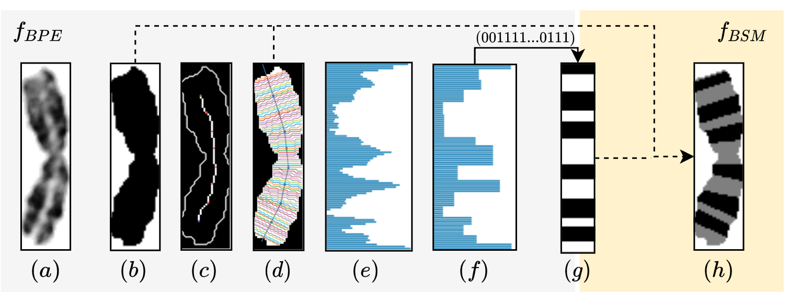

# Banding-Pattern-Extraction

A package that offers multiple functionalities regarding banding pattern extraction of stained banded chromosome images, used in our work to generate novel chromosomes based on their banding pattern (see [Deep Anomaly Generation](https://ieeexplore.ieee.org/document/9785372)). The extraction method is based on [0], but yields improvements such as angle interpolation in between perpendicular lines (see (d)). You can further generate banding pattern segmentation masks (see (h)) and impose Perlin noise banding patterns onto chromosome shapes.

If this work helps your research, please cite our paper (citation below).


### Installing this module

You can install this package globally on your device via pip:

`$ pip3 install path/to/Banding-Pattern-Extraction`


### Importing this module

Import the package in your python script via:

```python
import banding_pattern_extraction
```


### Interface

This package offers a programmatic python interface, as well as some stand-alone functionalities that can be called via the shell.


#### Command Line Interface

- `$ banding_pattern_extraction/banding_pattern_extraction.py`
  - Show the extracted banding pattern and debugging information for one banding pattern.
- `$ banding_pattern_extraction/banding_pattern_extraction_from_folder.py`
  - Extracts multiple banding patterns from a folder of images and saves them as binary vectors in a csv.
- `$ banding_pattern_extraction/banding_pattern_statistics.py`
  - Extract statistics banding pattern statistics (mean, max length) from a folder of chromosome images and saves them in a csv.
- `$ banding_pattern_extraction/chromosome_segmentation.py`
  - Creates a banding pattern segmentation mask of a stained chromosome image
- `$ banding_pattern_extraction/chromosome_segmentation_from_folder.py`
  - Creates banding pattern segmentation masks of a stained chromosome images and saves them into a folder.
- `$ banding_pattern_extraction/impose_random_banding_pattern.py`
  - Imposes a random Perlin banding pattern onto a chromosome image.
- `$ banding_pattern_extraction/impose_random_banding_pattern_from_folder.py`
  - Imposes a random Perlin banding patterns onto chromosome images and saves them into a folder.

Find more details for each function by calling `$ python3 <script> -h`.


**Examples:**

A synthetic chromosome image is included to test out the functionalities, run for example: 

*Extraction:*

```shell
python3 banding_pattern_extraction/banding_pattern_extraction.py -p banding_pattern_extraction/imgs/synthetic_chromosome.png
```
*Segmentation:*

```shell
python3 banding_pattern_extraction/chromosome_segmentation.py -p banding_pattern_extraction/imgs/synthetic_chromosome.png
```
*Impose a random banding pattern:*

```shell
python3 banding_pattern_extraction/impose_random_banding_pattern.py -p banding_pattern_extraction/imgs/synthetic_chromosome.png
```


#### Python3 Interface

Here some short examples on how to call the interface. For more descriptions look into the function comments.

```python
import banding_pattern_extraction as BPE

"""Banding pattern extraction"""
# Extract a banding pattern from a single image
result = BPE.get_banding_pattern(...)

# Extract a batch of banding patterns in a multiprocessing fashing
results = BPE.get_banding_pattern_multi_process(...)

# Get the banding pattern segmentation mask of a chromosome
segmented_chromosome = BPE.get_segmented_chromosome(...)

# Imposes a random banding pattern onto a chromosome shape
imposed_bp_img = BPE.impose_random_bp(...)

"""Visualisation utils"""
# Creates a 2D visualisation of a banding pattern vector
mat = BPE.binary_vector_to_bp_image(...)

# Create a matplotlib comparison image of input vs. output banding patterns
fig = BPE.binary_vector_comparison_img(...)

"""Utilitiy functions"""
# Generate a batch of fake banding patterns based on perlin noise
fake_bps = BPE.generate_random_banding_pattern(...)

# Clip a banding pattern symmetrically
bp = BPE.clip_bp(...)

# Pad a banding pattern symmetrically
bp = BPE.pad_bp(...)

# One hot encode a banding pattern
one_hot_bp = BPE.one_hot_encode(...)

```


## Citation

```latex
@ARTICLE{9785372,
  author={Uzolas, Lukas and Rico, Javier and Coup&#x00E9;, Pierrick and SanMiguel, Juan C. and Cserey, Gy&#x00F6;rgy},
  journal={IEEE Access}, 
  title={Deep Anomaly Generation: An Image Translation Approach of Synthesizing Abnormal Banded Chromosome Images}, 
  year={2022},
  volume={10},
  number={},
  pages={59090-59098},
  doi={10.1109/ACCESS.2022.3178786}}
```


## References:

[0]: Wang, X., Zheng, B., Li, S., Mulvihill, J.J. and Liu, H., 2008. A  rule-based computer scheme for centromere identification and polarity  assignment of metaphase chromosomes. *computer methods and programs in biomedicine*, *89*(1), pp.33-42.


## License:

Shield: [![CC BY-NC-SA 4.0][cc-by-nc-sa-shield]][cc-by-nc-sa]

This work is licensed under a [Creative Commons Attribution-NonCommercial-ShareAlike 4.0 International License][cc-by-nc-sa].

[![CC BY-NC-SA 4.0][cc-by-nc-sa-image]][cc-by-nc-sa]

[cc-by-nc-sa]: http://creativecommons.org/licenses/by-nc-sa/4.0/
[cc-by-nc-sa-image]: https://licensebuttons.net/l/by-nc-sa/4.0/88x31.png
[cc-by-nc-sa-shield]: https://img.shields.io/badge/License-CC%20BY--NC--SA%204.0-lightgrey.svg
